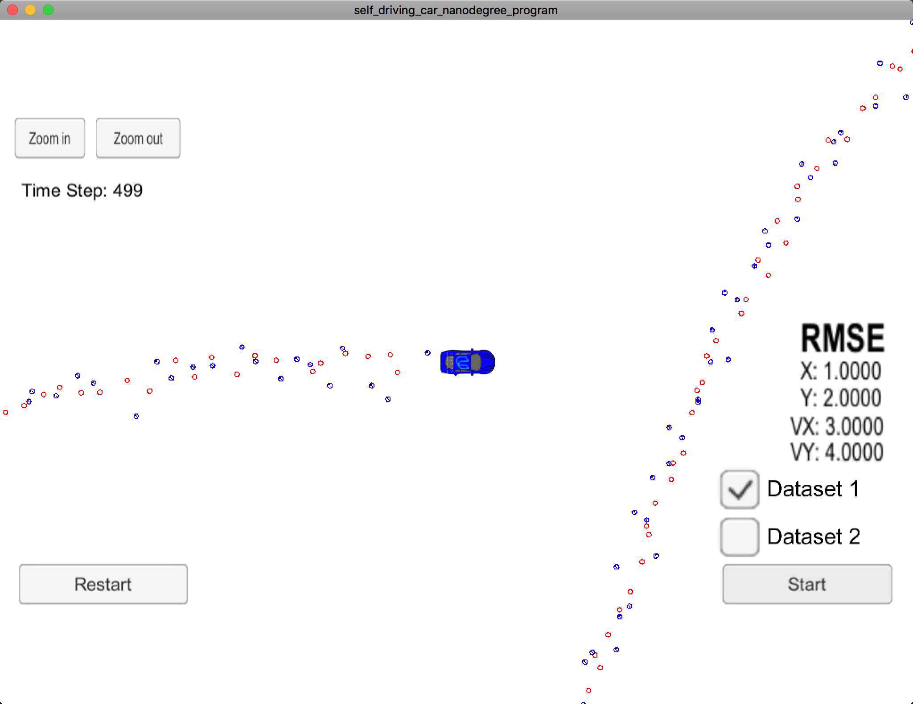
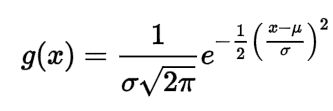

# Extended Kalman Filter Project
Self-Driving Car Engineer Nanodegree Program

### Project Setup


In this project you will utilize a kalman filter to estimate the state of a moving object of interest with noisy lidar and radar measurements. Passing the project requires obtaining RMSE values that are lower that the tolerance outlined in the project rubric. 

This project involves the Term 2 Simulator which can be downloaded [here](https://github.com/udacity/self-driving-car-sim/releases)

This repository includes two files that can be used to set up and install [uWebSocketIO](https://github.com/uWebSockets/uWebSockets) for either Linux or Mac systems. For windows you can use either Docker, VMware, or even [Windows 10 Bash on Ubuntu](https://www.howtogeek.com/249966/how-to-install-and-use-the-linux-bash-shell-on-windows-10/) to install uWebSocketIO. Please see [this concept in the classroom](https://classroom.udacity.com/nanodegrees/nd013/parts/40f38239-66b6-46ec-ae68-03afd8a601c8/modules/0949fca6-b379-42af-a919-ee50aa304e6a/lessons/f758c44c-5e40-4e01-93b5-1a82aa4e044f/concepts/16cf4a78-4fc7-49e1-8621-3450ca938b77) for the required version and installation scripts.

Once the install for uWebSocketIO is complete, the main program can be built and run by doing the following from the project top directory.

1. mkdir build
2. cd build
3. cmake ..
4. make
5. ./ExtendedKF

##### Install Self Driving Car Simulator
https://github.com/udacity/self-driving-car-sim/releases/


##### Install uWebSocket
For Mac, run ```install-mac.sh```

For Ubuntu, run ```install-ubuntu.sh```

## Test Connectivity before start coding

```c++
#include <iostream>
#include "tools.h"

using Eigen::VectorXd;
using Eigen::MatrixXd;
using std::vector;

Tools::Tools() {}

Tools::~Tools() {}

VectorXd Tools::CalculateRMSE(const vector<VectorXd> &estimations,
                              const vector<VectorXd> &ground_truth) {
  VectorXd temp(4);
  temp << 1, 2, 3, 4;
  return temp;
}

MatrixXd Tools::CalculateJacobian(const VectorXd& x_state) {
  MatrixXd temp(3,4);
  return temp;
}
```

Run simulator you should able to see it connected to this project, simulator will display RMSE we just setup in code




## Other Important Dependencies

* cmake >= 3.5
  * All OSes: [click here for installation instructions](https://cmake.org/install/)
* make >= 4.1 (Linux, Mac), 3.81 (Windows)
  * Linux: make is installed by default on most Linux distros
  * Mac: [install Xcode command line tools to get make](https://developer.apple.com/xcode/features/)
  * Windows: [Click here for installation instructions](http://gnuwin32.sourceforge.net/packages/make.htm)
* gcc/g++ >= 5.4
  * Linux: gcc / g++ is installed by default on most Linux distros
  * Mac: same deal as make - [install Xcode command line tools](https://developer.apple.com/xcode/features/)
  * Windows: recommend using [MinGW](http://www.mingw.org/)

## Basic Build Instructions

1. Clone this repo.
2. Make a build directory: `mkdir build && cd build`
3. Compile: `cmake .. && make` 
   * On windows, you may need to run: `cmake .. -G "Unix Makefiles" && make`
4. Run it: `./ExtendedKF `

# RMSE Result

|Lidar + Radar | Lidar    | Radar |
|-------------:|---------:|------:|
| X: 0.0973    | 0.1473   | 0.2302|
| Y: 0.0855    | 0.1153   | 0.3464|
|VX: 0.4513    | 0.6383   | 0.5835|
|VY: 0.4399    | 0.5346   | 0.8040|

By combine both Lidar and Radar measurement with Kalman Filter, we got better result.

[](https://youtu.be/0wFjfPko058)

[](https://youtu.be/lujr4PUlCWw)

[](https://youtu.be/mmXYubE_y70)


# How it works
## Gaussian
A [Gaussian](https://en.wikipedia.org/wiki/Gaussian_function) or [Gaussian Function](https://en.wikipedia.org/wiki/Gaussian_function)
defined by


Given some example below:


#References
## Kalman Filters
https://www.youtube.com/watch?v=CaCcOwJPytQ&list=PLX2gX-ftPVXU3oUFNATxGXY90AULiqnWT

